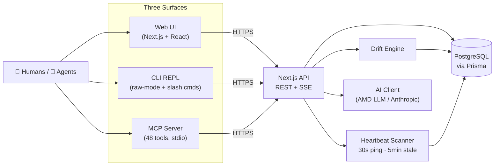

<div align="center">

# PlanSync

### _Plan-aware execution layer for AI agents and humans_

[](https://aihackathoncdc2026.amd.com/)
[](https://modelcontextprotocol.io/)
[](https://nextjs.org/)
[](https://www.typescriptlang.org/)
[](https://www.postgresql.org/)
[](#license)

**Plans change. Agents don't notice. Work silently drifts.**
PlanSync gives AI coding agents a shared, versioned source of truth — and tells them the moment it changes.

[简体中文](./README.zh-CN.md) · [Quick Start](#-quick-start) · [Architecture](#-architecture) · [MCP Tools](#-mcp-tool-surface)

</div>

---

## 🎯 The 30-Second Pitch

In an AI-assisted team, the deadliest bug isn't in the code — it's the **stale plan** in someone's chat window.
The Owner edits the spec. Three agents and two humans keep building against last week's version. Nobody notices until merge day.

**PlanSync makes plan-drift impossible to ignore:**

- 📝 **Versioned plans** — every change is a new immutable version with a reviewer-approval workflow.
- 🚨 **Automatic drift detection** — the moment a new plan is activated, every in-flight task is scanned and flagged with severity (HIGH if currently executing).
- 🔄 **Execution heartbeats** — running tasks ping every 30 s; zombie work is auto-killed.
- 🔌 **Native to your AI tool** — 48 MCP tools plug straight into **Claude Code, Cursor, and Genie**. No new dashboard to babysit.
- 🌐 **Three surfaces, one truth** — Web UI for planning, CLI REPL for the keyboard-first, MCP for in-IDE agents. All real-time via SSE.

---

## 🎬 Demo

```text
██████╗ ██╗      █████╗ ███╗   ██╗███████╗██╗   ██╗███╗   ██╗ ██████╗
██╔══██╗██║     ██╔══██╗████╗  ██║██╔════╝╚██╗ ██╔╝████╗  ██║██╔════╝
██████╔╝██║     ███████║██╔██╗ ██║███████╗ ╚████╔╝ ██╔██╗ ██║██║
██╔═══╝ ██║     ██╔══██║██║╚██╗██║╚════██║  ╚██╔╝  ██║╚██╗██║██║
██║     ███████╗██║  ██║██║ ╚████║███████║   ██║   ██║ ╚████║╚██████╗
╚═╝     ╚══════╝╚═╝  ╚═╝╚═╝  ╚═══╝╚══════╝   ╚═╝   ╚═╝  ╚═══╝ ╚═════╝

PlanSync [Terminal Mode] · alice · auth-module
─────────────────────────────────────────────────
Active Plan   v2 "OAuth2 with OIDC integration"
Goal          Replace legacy session auth with OIDC-backed JWT
─────────────────────────────────────────────────
Tasks         12 · 5 done / 2 in progress / 5 todo
Drift         ⚠ 2 alerts (rebind required)
─────────────────────────────────────────────────

> Start task TASK-42

⚠ Plan changed — execution paused
  Task "Implement /auth/callback" was bound to v1, current plan is v2
  Reason: scope expanded to require PKCE flow
  → resolve with: rebind | no_impact | cancel
```

<!--
📸 Screenshot slots — drop PNGs into docs/img/ and the references below light up.
   Suggested captures (run `bash scripts/demo-terminal.sh` then snap):
     - docs/img/dashboard.png       ← project list with drift badges
     - docs/img/drift-alert.png     ← task page with drift card + AI semantic diff
     - docs/img/plan-diff.png       ← side-by-side plan version diff
-->

|            Web Dashboard             |            Drift Alert             |            Plan Diff            |
| :----------------------------------: | :--------------------------------: | :-----------------------------: |
|  |  |  |

---

## ✨ Why PlanSync?

|     | Feature                                 | What makes it interesting                                                                                                                                | Code                                                        |
| :-: | :-------------------------------------- | :------------------------------------------------------------------------------------------------------------------------------------------------------- | :---------------------------------------------------------- |
| 🚨  | **Automatic Drift Detection**           | On plan activation, scans every task, ranks severity by execution state (HIGH if a run is alive), and ships AI-enriched impact analysis to the assignee. | [`drift-engine.ts`](packages/api/src/lib/drift-engine.ts)   |
| 🔐  | **Execution-Scoped Ephemeral Keys**     | Agents mint short-lived keys bound to a single execution run. TTL 1 s – 7 d. Scoped sessions cannot mint nested tokens — kills key sprawl.               | [`exec-sessions/`](packages/api/src/app/api/exec-sessions/) |
| 📜  | **Versioned Plans + Reviewer Workflow** | Plans are immutable. `draft → proposed → active → superseded`. Per-reviewer focus notes let the owner tell each reviewer what to look at.                | [`plans/`](packages/api/src/app/api/projects/)              |
| 🌐  | **One Backend, Three Surfaces**         | Web UI (Next.js), CLI REPL (raw-mode), MCP server (48 tools). All share auth, state, and SSE — no context switch.                                        | [`packages/`](packages/)                                    |
| 🤖  | **AI-Powered Semantic Diff & Verify**   | Plan diffs go through an LLM to surface _meaningful_ changes. Task completion is checked against deliverables before being accepted.                     | [`lib/ai/`](packages/api/src/lib/ai/)                       |

---

## 🏗 Architecture



**Three packages, one truth:** `packages/api` (server + Web UI), `packages/cli` (terminal), `packages/mcp-server` (IDE bridge), with `packages/shared` for Zod schemas across all of them.

---

## 🚀 Quick Start

```bash
# 1. Owner — start the local PlanSync service (auto-installs Node, Postgres, runs migrations)
./bin/ps-admin start

# 2. Member — connect your AI tool (pick one)
./bin/plansync --host claude    # Claude Code
./bin/plansync --host cursor    # Cursor
./bin/plansync --host genie     # Genie  (default)

# 3. Open the Web UI
open http://localhost:3001

# 4. (optional) Run the multi-user demo
bash scripts/demo-terminal.sh
```

> 💡 **No global Node/npm needed.** Both launchers prepare a project-local runtime in `.local-runtime/node`.
> 💡 **Cluster / NFS users:** run [`./bin/ps-connect`](bin/ps-connect) from any machine — it SSHes to the server, forwards the port, and sets your identity from `$USER`.

---

## 🔄 Lifecycle in One Diagram

```text
   Owner                         Members / Agents
   ─────                         ────────────────
   plan_create  ─┐
   plan_propose  │  reviewers ─► review_approve / review_reject
   plan_activate ┘
        │
        ▼
   task_create ─► assignee ─► task_pack ─► execution_start
                                              │ (heartbeat 30s)
                                              ▼
                                          execution_complete
                                              │
   ┌────────────────────────────────────────────────────────────┐
   │ Owner edits + activates plan v2                            │
   │   ▼                                                        │
   │ drift-engine scans all tasks ─► DriftAlert (HIGH/MED/LOW)  │
   │   ▼                                                        │
   │ Assignee resolves: rebind  →  align task to v2             │
   │                    no_impact → ack, keep v1                │
   │                    cancel  →  release task                 │
   └────────────────────────────────────────────────────────────┘
```

---

## 🧰 MCP Tool Surface

48 tools, designed to feel native inside an AI chat.

| Domain                    | Tools | Examples                                                                                        |
| :------------------------ | :---: | :---------------------------------------------------------------------------------------------- |
| **Status & Context**      |   4   | `plansync_status`, `plansync_my_work`, `plansync_exec_context`                                  |
| **Projects & Members**    |   9   | `plansync_project_create`, `plansync_member_add`                                                |
| **Plans**                 |   9   | `plansync_plan_create`, `plansync_plan_propose`, `plansync_plan_activate`, `plansync_plan_diff` |
| **Reviews & Comments**    |   5   | `plansync_review_approve`, `plansync_comment_create`                                            |
| **Tasks**                 |   8   | `plansync_task_pack`, `plansync_task_claim`, `plansync_task_rebind`                             |
| **Execution**             |   4   | `plansync_execution_start`, `plansync_execution_complete` (auto-heartbeat)                      |
| **Drift**                 |   2   | `plansync_drift_list`, `plansync_drift_resolve`                                                 |
| **Suggestions**           |   2   | `plansync_plan_suggest`, `plansync_suggestion_list`                                             |
| **Delegation & Activity** |   5   | `plansync_my_work agentName=…`, `plansync_delegation_clear`, `plansync_who`                     |

Implementation lives in [`packages/mcp-server/src/tools/`](packages/mcp-server/src/tools/).

---

## 🛠 Tech Stack

| Layer          | Choice                                                                   |
| :------------- | :----------------------------------------------------------------------- |
| **Backend**    | Next.js 14 (App Router) · TypeScript 5.7                                 |
| **Database**   | PostgreSQL 13+ via Prisma 5.22                                           |
| **Web UI**     | React 18 · Tailwind CSS 3 · Radix UI                                     |
| **CLI**        | Node.js raw-mode REPL · slash commands · MCP client                      |
| **MCP Server** | `@modelcontextprotocol/sdk` 1.3 · esbuild bundling · stdio transport     |
| **Realtime**   | Server-Sent Events (per-project + per-user streams)                      |
| **Auth**       | `crypto.scrypt` password hashing · Bearer tokens · execution-scoped keys |
| **AI**         | AMD internal LLM API (Anthropic-compatible) **or** Anthropic SDK         |
| **Schemas**    | Zod 3.24 shared across api / cli / mcp                                   |

---

## ⚙️ Configuration

A single **`.env`** at the repo root drives everything. `./bin/ps-admin` and `./bin/plansync` create it from [`.env.example`](.env.example) on first run.

| Variable                                          | Default                                           | Purpose                                              |
| :------------------------------------------------ | :------------------------------------------------ | :--------------------------------------------------- |
| `PLANSYNC_USER`                                   | `$USER`                                           | Your identity in PlanSync                            |
| `PLANSYNC_API_URL`                                | `http://localhost:3001`                           | API server address                                   |
| `PLANSYNC_API_KEY`                                | _(prompted)_                                      | Personal API key                                     |
| `PLANSYNC_PROJECT`                                | —                                                 | Pre-select active project                            |
| `DATABASE_URL`                                    | `postgresql://$USER@localhost:15432/plansync_dev` | Postgres connection                                  |
| `PG_PORT`                                         | `15432`                                           | Postgres port (use `15000+UID%1000` on shared hosts) |
| `PORT`                                            | `3001`                                            | API port                                             |
| `LOG_LEVEL`                                       | `info`                                            | `debug \| info \| warn \| error`                     |
| `EMAIL_DOMAIN`                                    | `amd.com`                                         | Appended to `$USER` for drift notifications          |
| `LLM_API_KEY` / `LLM_API_BASE` / `LLM_MODEL_NAME` | —                                                 | AMD internal LLM (Anthropic-compatible)              |
| `ANTHROPIC_API_KEY`                               | —                                                 | Anthropic official API (alternative)                 |

---

## 📁 Project Layout

```
PlanSync/
├── packages/
│   ├── api/             # Next.js REST + SSE backend, Web UI, Prisma schema
│   │   ├── src/app/api/ # 58 route handlers
│   │   ├── src/lib/     # drift-engine · heartbeat-scanner · ai/ · auth · webhook
│   │   └── prisma/      # schema.prisma + migrations
│   ├── mcp-server/      # 48 MCP tools, esbuild-bundled, stdio transport
│   ├── cli/             # Raw-mode REPL with slash commands & SSE listener
│   ├── shared/          # Zod schemas + shared types
│   └── integrations/
│       └── github-action/  # PR check: is your task aligned with the active plan?
├── bin/
│   ├── ps-admin         # Owner: bootstrap + start API
│   ├── plansync         # Member: launch terminal / Claude / Cursor / Genie
│   ├── ps-connect       # NFS / cluster: SSH + port-forward + connect
│   └── start-mcp        # MCP entry-point (used by .claude/settings.json)
├── scripts/
│   ├── demo-terminal.sh # Multi-user end-to-end demo
│   ├── demo-webui.js    # Browser-driven Web UI walkthrough
│   ├── setup.sh · dev.sh · build.sh
│   └── db-reset.sh · db-psql.sh
├── CLAUDE.md            # Terminal Mode behaviour spec
├── AGENTS.md            # Agent execution rules (drift handling, exec flow)
└── PLAN.md              # Internal design doc
```

---

## 📚 Going Deeper

- **[CLAUDE.md](./CLAUDE.md)** — how PlanSync Terminal Mode behaves (session start, exec mode, delegation)
- **[AGENTS.md](./AGENTS.md)** — execution rules every agent must follow
- **[PLAN.md](./PLAN.md)** — internal design notes
- **[README.zh-CN.md](./README.zh-CN.md)** — Chinese (legacy structure; mirror of new README is a TODO)
- **[README.old.md](./README.old.md)** — previous English README, kept for reference

### Common commands

| Command                                          | Purpose                                         |
| :----------------------------------------------- | :---------------------------------------------- |
| `./bin/ps-admin start`                           | Bootstrap server runtime + DB and start the API |
| `./bin/plansync --host <claude\|cursor\|genie>`  | Start client, auto-inject MCP config            |
| `./bin/ps-connect --host claude`                 | Same, but on a remote / NFS server              |
| `bash scripts/build.sh`                          | Build all workspace packages                    |
| `bash scripts/test.sh` / `lint.sh` / `format.sh` | Quality checks                                  |
| `bash scripts/db-reset.sh`                       | Wipe and recreate the database                  |
| `bash scripts/db-psql.sh`                        | Open a `psql` shell                             |

---

## 🛟 FAQ

| Problem                            | Fix                                                                                  |
| :--------------------------------- | :----------------------------------------------------------------------------------- |
| Tasks don't appear                 | `PLANSYNC_USER` in `.env` must match the name the Owner registered (case-sensitive). |
| `assignee is not a project member` | Have the Owner run `plansync_member_add` first.                                      |
| `permission denied`                | `PLANSYNC_SECRET` / API key in `.env` doesn't match the server.                      |
| Want to start fresh                | `bash scripts/db-reset.sh`.                                                          |
| Forgot port on shared host         | Each user needs a unique `PG_PORT`; suggested `expr 15000 + $(id -u) % 1000`.        |

---

## 📦 NFS / Cluster Notes

This project is built to live happily on shared NFS-mounted filesystems:

- PostgreSQL data is kept in `/tmp` (avoids NFS file-locking pain)
- npm cache redirected to `/tmp/npm-cache-$USER`
- Node runtime is repo-local under `.local-runtime/node`
- MCP server is `esbuild`-bundled (avoids `tsc` OOM on NFS)

---

## 📝 License

MIT — see `LICENSE` if present, otherwise inherit project default.

---

<div align="center">

**Built for the [AMD AI Hackathon CDC 2026](https://aihackathoncdc2026.amd.com/)** 🚀

<sub>Designed and built by the PlanSync team. Contributions, issues, and ideas welcome.</sub>

</div>
