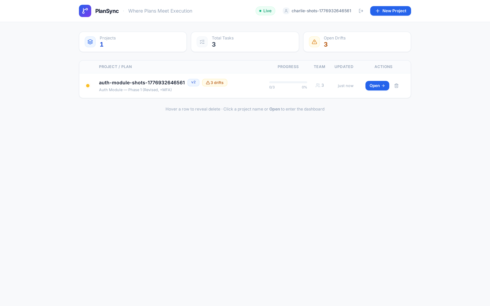
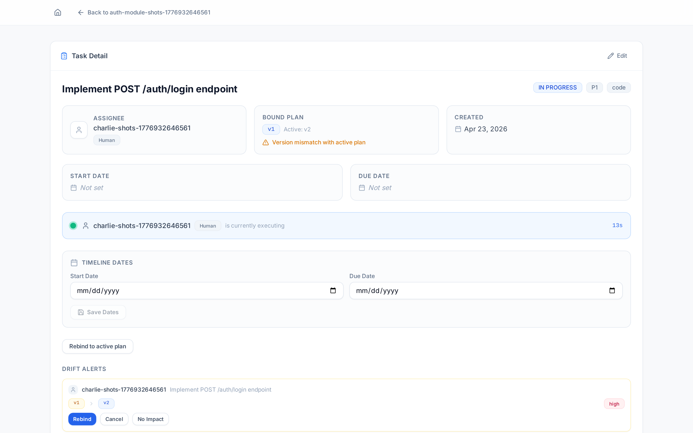
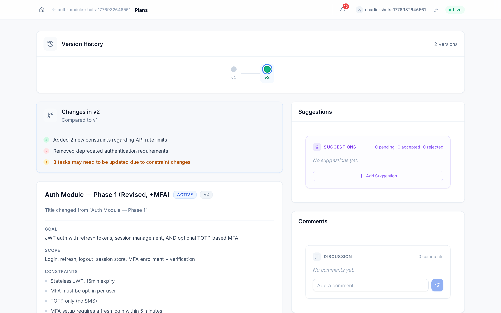
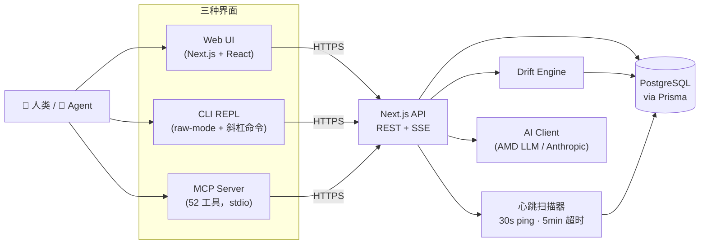

<div align="center">

# PlanSync

### _面向 AI Agent 与人类协作的「计划感知」执行层_

[](https://aihackathoncdc2026.amd.com/)
[](https://modelcontextprotocol.io/)
[](https://nextjs.org/)
[](https://www.typescriptlang.org/)
[](https://www.postgresql.org/)
[](#license)

**计划在变，Agent 不知道，工作在悄悄漂移。**
PlanSync 给 AI Coding Agent 一份共享的、带版本的"权威计划"——并在它发生变化的瞬间通知所有人。

[English](./README.md) · [快速开始](#-快速开始) · [架构](#-架构) · [MCP 工具清单](#-mcp-工具清单)

</div>

---

## 🎯 30 秒讲清楚

AI 协作团队里最致命的 Bug 不在代码里——而是某人聊天窗口里那份**过时的计划**。
Owner 改了 spec。三个 agent 加两个人类继续按上周的版本写代码，没人发觉，直到合并那天才爆。

**PlanSync 让计划漂移无处藏身：**

- 📝 **版本化计划** — 每次变更都是一个不可变的新版本，自带 reviewer 评审流程。
- 🚨 **自动漂移检测** — 新计划一被激活，所有进行中的任务都会被扫描并按严重度打标（正在执行中 = HIGH）。
- 🔄 **执行心跳** — 运行中的任务每 30 秒上报一次，僵尸任务自动回收。
- 🔌 **AI 工具原生集成** — 52 个 MCP 工具直接接入 **Claude Code、Cursor、Genie**，无需切换面板。
- 🌐 **三种界面，同一份真相** — 网页 UI 用于规划、CLI REPL 给键盘党、MCP 给 IDE 内的 agent，全部 SSE 实时同步。

---

## 🎬 演示

```text
██████╗ ██╗      █████╗ ███╗   ██╗███████╗██╗   ██╗███╗   ██╗ ██████╗
██╔══██╗██║     ██╔══██╗████╗  ██║██╔════╝╚██╗ ██╔╝████╗  ██║██╔════╝
██████╔╝██║     ███████║██╔██╗ ██║███████╗ ╚████╔╝ ██╔██╗ ██║██║
██╔═══╝ ██║     ██╔══██║██║╚██╗██║╚════██║  ╚██╔╝  ██║╚██╗██║██║
██║     ███████╗██║  ██║██║ ╚████║███████║   ██║   ██║ ╚████║╚██████╗
╚═╝     ╚══════╝╚═╝  ╚═╝╚═╝  ╚═══╝╚══════╝   ╚═╝   ╚═╝  ╚═══╝ ╚═════╝

PlanSync [Terminal Mode] · alice · auth-module
─────────────────────────────────────────────────
Active Plan   v2 "OAuth2 with OIDC integration"
Goal          用 OIDC 后端的 JWT 替换旧的 session 鉴权
─────────────────────────────────────────────────
Tasks         12 · 5 done / 2 in progress / 5 todo
Drift         ⚠ 2 alerts (rebind required)
─────────────────────────────────────────────────

> 开始任务 TASK-42

⚠ 计划已变更 — 执行已暂停
  任务 "Implement /auth/callback" 绑定的是 v1，当前激活计划是 v2
  原因：scope 扩展，新增 PKCE 流程要求
  → 解决方式：rebind | no_impact | cancel
```

|               网页面板               |              漂移告警              |            计划 Diff            |
| :----------------------------------: | :--------------------------------: | :-----------------------------: |
|  |  |  |

---

## ✨ 为什么是 PlanSync？

|     | 特性                       | 看点                                                                                                                             | 代码                                                        |
| :-: | :------------------------- | :------------------------------------------------------------------------------------------------------------------------------- | :---------------------------------------------------------- |
| 🚨  | **自动漂移检测**           | 计划被激活后，扫描每一个任务，按执行状态打严重度（运行中 = HIGH），并把 AI 加工后的影响分析推送给负责人。                        | [`drift-engine.ts`](packages/api/src/lib/drift-engine.ts)   |
| ✅  | **AI 验收任务完成**        | Agent 调用 `execution_complete` 时，LLM 会拿 `deliverablesMet` 与 plan / task brief 做比对，含糊其词的"完成"会被打分驳回。       | [`lib/ai/`](packages/api/src/lib/ai/)                       |
| 🔮  | **AI 任务冲突预测**        | `plansync_check_task_conflicts` 在分配前预演范围重叠、依赖关系、资源冲突。                                                       | [`lib/ai/`](packages/api/src/lib/ai/)                       |
| 🤝  | **多 Agent 委托**          | 一个人可以驱动多个 agent —— `asAgent` / `asUser` 让你以任何成员身份评审、评论、执行。Owner 专属操作在 API 层硬性拦截，安全可控。 | [`lib/auth.ts`](packages/api/src/lib/auth.ts)               |
| 🔁  | **`/exec` 子会话派发**     | Terminal Mode 预加载任务上下文，`/exec` 把工作派发给 Genie/Claude 的全 IDE 工具。注册执行、心跳、AI 验收一条龙自动接好。         | [`exec-sessions/`](packages/api/src/app/api/exec-sessions/) |
| 📜  | **版本化计划 + 评审流**    | 计划不可变：`draft → proposed → active → superseded → 可回滚 reactivate`。每个 reviewer 可被指定 focus 关注点。                  | [`tools/plan.ts`](packages/mcp-server/src/tools/plan.ts)    |
| 🌐  | **一套后端，三种界面**     | Web UI（Next.js）、CLI REPL（raw-mode）、MCP server（52 工具）。共用鉴权、状态、SSE，无需切换上下文。                            | [`packages/`](packages/)                                    |
| 🪝  | **GitHub Action 漂移闸门** | 一个可复用的 Action，如果 PR 关联的任务已与当前激活计划脱节，则 PR 检查失败。漂移别想从合并环节溜进来。                          | [`github-action/`](packages/integrations/github-action/)    |

---

## 🏗 架构



**三个包，同一份真相：** `packages/api`（服务端 + Web UI）、`packages/cli`（终端）、`packages/mcp-server`（IDE 桥接），加 `packages/shared` 提供跨包共享的 Zod schema。

---

## 🚀 快速开始

PlanSync 有两种角色，选你对应的那条走。

### 👑 Owner —— 搭起团队

```bash
# 1. 启动服务端。自动把 Node + Postgres 装到 .local-runtime/，
#    自动从 .env.example 生成 .env，跑 migration，全程不提问。
./bin/ps-admin start
```

> **以下两种情况，启动前先编辑 `.env`：**
>
> - **共享主机 / 集群** —— 修改 `PG_PORT`，避免与同机其他用户冲突：
>   `PG_PORT=$(expr 15000 + $(id -u) % 1000)`
> - **想用 AI 功能**（语义 diff、完成验收、冲突预测）—— 设置 `LLM_API_KEY`（AMD 内部 LLM）或 `ANTHROPIC_API_KEY`。

```bash
# 2. 设置身份。首次运行会交互式询问用户名 + 密码，自动建账号，
#    密码作为 PLANSYNC_API_KEY 写到 ~/.config/plansync/env。之后直接进入。
./bin/plansync --host genie

# 3. 在 AI 对话或网页 UI（http://localhost:3001）里建项目 + 加成员：
#       > 创建项目 "auth-module"
#       > 添加成员 alice（developer）
#       > 添加成员 bob（developer）
```

### 🧑‍💻 Member —— 加入团队

```bash
# 1. 接入（首次同样会问用户名 + 密码 —— 和 Owner 步骤 2 一样，账号自动建）。
./bin/plansync --host genie       # 本机：与 Owner 在同一台机器
./bin/ps-connect --host genie     # 远程 / NFS：自动 SSH 到 Owner 服务器
```

然后在对话中：`> 我有哪些任务？`（Owner 把你加进项目之后）。

成员**不需要**编辑 `.env`，`bin/plansync` 和 `bin/ps-connect` 会替你处理身份。

### 其他 AI 工具

`--host genie` 是推荐路径（AMD 内部主机零额外安装）。备选：

- `--host claude` —— 需要 `claude` CLI 在 `PATH` 中
- `--host cursor` —— 写出 `.cursor/mcp.json`，然后自己打开 Cursor

### （可选）多用户演示

```bash
bash scripts/demo-terminal.sh
```

> 💡 **不需要全局 Node/npm。** 两个启动脚本都会在 `.local-runtime/node` 准备项目本地运行时。

---

## 🔄 一图看懂生命周期

```text
   Owner                         成员 / Agent
   ─────                         ────────────
   plan_create  ─┐
   plan_propose  │  reviewers ─► review_approve / review_reject
   plan_activate ┘
        │
        ▼
   task_create ─► assignee ─► task_pack ─► execution_start
                                              │ (心跳 30s)
                                              ▼
                                          execution_complete (AI 验收)
                                              │
   ┌────────────────────────────────────────────────────────────┐
   │ Owner 编辑 + 激活计划 v2                                    │
   │   ▼                                                        │
   │ drift-engine 扫描全部任务 ─► DriftAlert (HIGH/MED/LOW)      │
   │   ▼                                                        │
   │ 负责人选择：rebind   →  对齐到 v2                           │
   │             no_impact → 不影响，保持 v1                     │
   │             cancel   →  释放任务                            │
   └────────────────────────────────────────────────────────────┘
```

---

## 🧰 MCP 工具清单

52 个工具，专为 AI 对话原生体验设计。

| 域                | 数量 | 重点说明                                                                                                                                                                                                                                       |
| :---------------- | :--: | :--------------------------------------------------------------------------------------------------------------------------------------------------------------------------------------------------------------------------------------------- |
| **状态 & 上下文** |  3   | `plansync_status`、`plansync_my_work`、`plansync_exec_context`（识别 `/exec` 子会话并自动绑定 run）                                                                                                                                            |
| **项目**          |  6   | `plansync_project_create` / `_show` / `_list` / `_update` / `_switch` / `_delete`                                                                                                                                                              |
| **成员**          |  4   | `plansync_member_add`（人类 + agent） / `_list` / `_update` / `_remove`                                                                                                                                                                        |
| **计划**          |  14  | `_create`、`_propose`、`_activate`、`_reactivate`（回滚！）、`_diff`（AI 语义 diff）、`_suggest`（agent 可用的安全提案），外加四个 `_append` 助手（`constraints` / `deliverables` / `standards` / `openQuestions`），规避大计划下的 token 截断 |
| **评审 & 评论**   |  6   | `plansync_review_approve` / `_reject`（按用户名自动定位评审；委托用 `asUser`），完整评论 CRUD                                                                                                                                                  |
| **任务**          |  8   | `plansync_task_pack`（brief + 漂移闸门）、`_claim`、`_rebind`、`_decline`，完整 CRUD                                                                                                                                                           |
| **执行**          |  3   | `_start`、`_heartbeat`、`_complete` —— complete 时会走 **`deliverablesMet` 的 AI 验收**                                                                                                                                                        |
| **漂移**          |  2   | `plansync_drift_list`、`_resolve`（`rebind` / `no_impact` / `cancel`）                                                                                                                                                                         |
| **建议**          |  2   | `plansync_suggestion_list`、`_resolve`（owner 接受 / 拒绝）                                                                                                                                                                                    |
| **AI Assist**     |  1   | `plansync_check_task_conflicts` —— 预测正在进行的任务间的范围重叠与资源冲突                                                                                                                                                                    |
| **委托 & 活动**   |  3   | `plansync_my_work agentName=…`、`_delegation_clear`、`plansync_who`、`plansync_activity_list`                                                                                                                                                  |

实现位于 [`packages/mcp-server/src/tools/`](packages/mcp-server/src/tools/)。

---

## 🛠 技术栈

| 层级           | 选型                                                        |
| :------------- | :---------------------------------------------------------- |
| **后端**       | Next.js 14（App Router）· TypeScript 5.7                    |
| **数据库**     | PostgreSQL 13+ via Prisma 5.22                              |
| **Web UI**     | React 18 · Tailwind CSS 3 · Radix UI                        |
| **CLI**        | Node.js raw-mode REPL · 斜杠命令 · MCP 客户端               |
| **MCP Server** | `@modelcontextprotocol/sdk` 1.3 · esbuild 打包 · stdio 传输 |
| **实时**       | Server-Sent Events（按项目 + 按用户两种流）                 |
| **鉴权**       | `crypto.scrypt` 密码哈希 · Bearer Token · 执行级临时密钥    |
| **AI**         | AMD 内部 LLM API（Anthropic 兼容）**或** Anthropic SDK      |
| **Schemas**    | Zod 3.24，跨 api / cli / mcp 共享                           |

---

## ⚙️ 配置

仓库根目录的 **`.env`** 是唯一配置入口。`./bin/ps-admin` 和 `./bin/plansync` 首次运行会从 [`.env.example`](.env.example) 自动生成。

| 变量                                              | 默认                                              | 用途                                           |
| :------------------------------------------------ | :------------------------------------------------ | :--------------------------------------------- |
| `PLANSYNC_USER`                                   | `$USER`                                           | 你在 PlanSync 中的身份                         |
| `PLANSYNC_API_URL`                                | `http://localhost:3001`                           | API 服务地址                                   |
| `PLANSYNC_API_KEY`                                | _(交互式获取)_                                    | 个人 API Key                                   |
| `PLANSYNC_PROJECT`                                | —                                                 | 预选当前项目                                   |
| `DATABASE_URL`                                    | `postgresql://$USER@localhost:15432/plansync_dev` | Postgres 连接串                                |
| `PG_PORT`                                         | `15432`                                           | Postgres 端口（共享主机建议 `15000+UID%1000`） |
| `PORT`                                            | `3001`                                            | API 端口                                       |
| `LOG_LEVEL`                                       | `info`                                            | `debug \| info \| warn \| error`               |
| `EMAIL_DOMAIN`                                    | `amd.com`                                         | 拼到 `$USER` 后用于漂移通知                    |
| `LLM_API_KEY` / `LLM_API_BASE` / `LLM_MODEL_NAME` | —                                                 | AMD 内部 LLM（Anthropic 兼容）                 |
| `ANTHROPIC_API_KEY`                               | —                                                 | Anthropic 官方 API（备选）                     |

---

## 📁 项目结构

```
PlanSync/
├── packages/
│   ├── api/             # Next.js REST + SSE 后端、Web UI、Prisma schema
│   │   ├── src/app/api/ # 58 个路由 handler
│   │   ├── src/lib/     # drift-engine · heartbeat-scanner · ai/ · auth · webhook
│   │   └── prisma/      # schema.prisma + migrations
│   ├── mcp-server/      # 52 个 MCP 工具，esbuild 打包，stdio 传输
│   ├── cli/             # raw-mode REPL，含斜杠命令与 SSE 监听
│   ├── shared/          # Zod schema + 共享类型
│   └── integrations/
│       └── github-action/  # PR 检查：你的任务还和当前计划对齐吗？
├── bin/
│   ├── ps-admin         # Owner：bootstrap + 启动 API
│   ├── plansync         # 成员：启动终端 / Claude / Cursor / Genie
│   ├── ps-connect       # NFS / 集群：SSH + 端口转发 + 接入
│   └── start-mcp        # MCP 入口（被 .claude/settings.json 调用）
├── scripts/
│   ├── demo-terminal.sh # 多用户端到端演示
│   ├── demo-webui.js    # 浏览器驱动的 Web UI 演示
│   ├── setup.sh · dev.sh · build.sh
│   └── db-reset.sh · db-psql.sh
├── CLAUDE.md            # Terminal Mode 行为规约
└── AGENTS.md            # Agent 执行规则（漂移处理、执行流程）
```

---

## 📚 深入阅读

- **[CLAUDE.md](./CLAUDE.md)** —— PlanSync Terminal Mode 行为规约（会话开始、exec 模式、委托）
- **[AGENTS.md](./AGENTS.md)** —— 每个 agent 必须遵守的执行规则
- **[README.md](./README.md)** —— 英文版（hackathon 主版本）

### 常用命令

| 命令                                             | 用途                                   |
| :----------------------------------------------- | :------------------------------------- |
| `./bin/ps-admin start`                           | Bootstrap 服务端运行时 + DB 并启动 API |
| `./bin/plansync --host <claude\|cursor\|genie>`  | 启动客户端，自动注入 MCP 配置          |
| `./bin/ps-connect --host claude`                 | 远程 / NFS 服务器上同上                |
| `bash scripts/build.sh`                          | 构建所有 workspace 包                  |
| `bash scripts/test.sh` / `lint.sh` / `format.sh` | 质量检查                               |
| `bash scripts/db-reset.sh`                       | 清空并重建数据库                       |
| `bash scripts/db-psql.sh`                        | 打开 `psql` 终端                       |

---

## 🛟 FAQ

| 问题                               | 解决                                                                        |
| :--------------------------------- | :-------------------------------------------------------------------------- |
| 看不到任务                         | `.env` 中 `PLANSYNC_USER` 必须和 Owner 注册时的名字完全一致（区分大小写）。 |
| `assignee is not a project member` | 让 Owner 先跑 `plansync_member_add`。                                       |
| `permission denied`                | `.env` 中的 `PLANSYNC_API_KEY` 与服务端不匹配。                             |
| 想重新开始                         | `bash scripts/db-reset.sh`。                                                |
| 共享主机上忘了端口                 | 每个用户需要独立的 `PG_PORT`，建议 `expr 15000 + $(id -u) % 1000`。         |

---

## 📦 NFS / 集群环境说明

本项目针对共享 NFS 文件系统做了优化：

- PostgreSQL 数据存放在 `/tmp`（避开 NFS 文件锁问题）
- npm 缓存重定向到 `/tmp/npm-cache-$USER`
- Node 运行时安装到仓库内的 `.local-runtime/node`
- MCP server 用 `esbuild` 打包（避免 `tsc` 在 NFS 上 OOM）

---

## 📝 License

MIT —— 见仓库 `LICENSE` 文件，无则继承项目默认。

---

<div align="center">

**为 [AMD AI Hackathon CDC 2026](https://aihackathoncdc2026.amd.com/) 而生** 🚀

<sub>由 PlanSync 团队设计与构建。欢迎贡献代码、提 issue、贡献想法。</sub>

</div>
