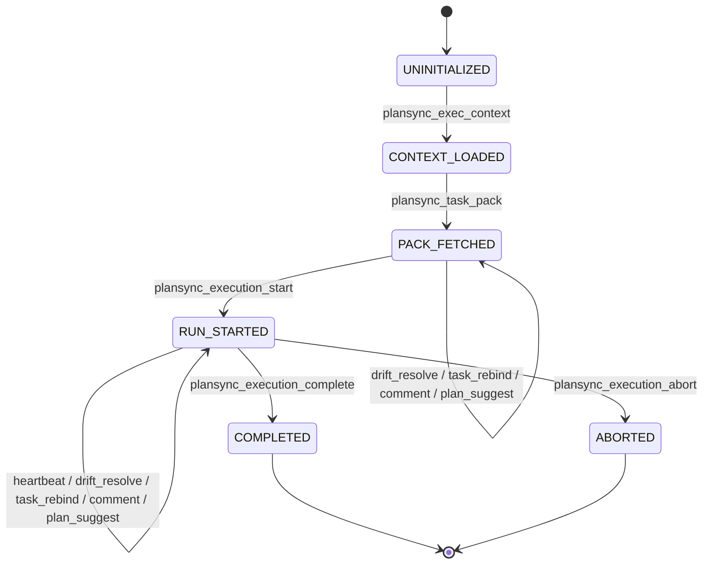

# PlanSync exec-mode protocol (R-170)

> **Status**: design / source-of-truth. Implementation lives in
> `packages/shared/src/protocol/exec-state.ts`. Wire-up into the MCP wrapper is
> tracked separately as **R-171**.

## Why this exists

Until now the contract between an LLM agent and the PlanSync MCP server was
_prose-encoded_ — `CLAUDE.md` told the agent what order to call tools, and the
server trusted it. In practice:

- generic MCP clients (Claude Desktop / Cursor / Continue) never read
  `CLAUDE.md` because it's a Claude Code convention,
- truncated prompts dropped the protocol section regularly,
- agents under retry pressure happily called `plansync_execution_complete`
  for runs that were never started, or skipped `plansync_task_pack` entirely.

The drift engine and the heartbeat scanner both had to learn to "tolerate"
these cases, which made the failure modes (race-lost runs, ghost completions)
indistinguishable from genuine bugs.

R-170 makes the protocol _mechanism_ instead of _prose_: every exec-mode tool
call is checked against a finite state machine on the server, and illegal
transitions return a structured `OUT_OF_SEQUENCE` error with a `nextRequired`
hint so the agent self-corrects without re-reading `CLAUDE.md`.

## State diagram

```
                         ┌──────────────────────┐
                         │     UNINITIALIZED    │
                         └──────────┬───────────┘
                                    │ plansync_exec_context
                                    ▼
                         ┌──────────────────────┐
                         │    CONTEXT_LOADED    │
                         └──────────┬───────────┘
                                    │ plansync_task_pack
                                    ▼
                         ┌──────────────────────┐
                         │     PACK_FETCHED     │  ← drift_resolve / task_rebind
                         │                      │    keep state here
                         └──────────┬───────────┘
                                    │ plansync_execution_start
                                    ▼
       ┌────────────────────────────┴────────────────────────────┐
       │                       RUN_STARTED                       │  ← heartbeat / drift_resolve /
       │                                                         │    task_rebind / comment_create /
       │                                                         │    plan_suggest keep state here
       └─────────────┬─────────────────────────────┬─────────────┘
                     │ plansync_execution_complete │ plansync_execution_abort
                     ▼                             ▼
              ┌──────────────┐              ┌──────────────┐
              │  COMPLETED   │              │   ABORTED    │
              └──────────────┘              └──────────────┘
                  (terminal)                    (terminal)
```

Mermaid form (for the docs site once it ships):



## State reference

| State            | Allowed gated tools                                                                                                                                                                             | requiredNextOneOf                                             |
| ---------------- | ----------------------------------------------------------------------------------------------------------------------------------------------------------------------------------------------- | ------------------------------------------------------------- |
| `UNINITIALIZED`  | `plansync_exec_context`                                                                                                                                                                         | `plansync_exec_context`                                       |
| `CONTEXT_LOADED` | `plansync_task_pack`, `plansync_exec_context`                                                                                                                                                   | `plansync_task_pack`                                          |
| `PACK_FETCHED`   | `plansync_task_pack`, `plansync_execution_start`, `plansync_drift_resolve`, `plansync_task_rebind`, `plansync_comment_create`, `plansync_plan_suggest`                                          | `plansync_execution_start`                                    |
| `RUN_STARTED`    | `plansync_execution_heartbeat`, `plansync_execution_complete`, `plansync_execution_abort`, `plansync_drift_resolve`, `plansync_task_rebind`, `plansync_comment_create`, `plansync_plan_suggest` | `plansync_execution_heartbeat`, `plansync_execution_complete` |
| `COMPLETED`      | —                                                                                                                                                                                               | —                                                             |
| `ABORTED`        | —                                                                                                                                                                                               | —                                                             |

Read-only tools (`plansync_status`, `plansync_who`, `plansync_*_list`,
`plansync_*_show`, `plansync_plan_active`, `plansync_plan_diff`,
`plansync_my_work`, `plansync_check_task_conflicts`, …) are accepted from
**any** state, including terminal ones, and never advance the FSM. The
canonical list lives in `READ_ONLY_TOOLS` in `exec-state.ts`.

## State token

Every successful tool response carries an opaque `stateToken`. The agent must
hand it back on the next call; the MCP server uses it as the source of truth
for the current FSM state instead of trusting client-side memory.

Token wire format (assembled by the API server in R-171, **not** by this
package):

```
stateToken = base64url(JSON(payload)) + '.' + base64url(HMAC_SHA256(PLANSYNC_SECRET, JSON(payload)))
```

Payload contract — defined by
[`execStateTokenPayloadSchema`](../packages/shared/src/protocol/exec-state.ts):

```ts
{
  v: 1,                  // payload schema version
  runId: string,         // execution_runs.id
  projectId: string,     // scoping for R-011 / R-137
  state: ExecState,      // current FSM state
  issuedAt: number,      // ms since epoch
  taskId?: string,       // diagnostic only
}
```

Tokens are short-lived — `EXEC_STATE_TOKEN_MAX_AGE_MS = 24h`. After expiry
the server rejects them and the agent must restart from `plansync_exec_context`.

## Error contract — `OUT_OF_SEQUENCE`

Illegal transitions return a structured tool error rather than a text-only
"please call X first" message, so generic MCP clients can render it without
parsing prose:

```json
{
  "isError": true,
  "error": {
    "code": "OUT_OF_SEQUENCE",
    "message": "Tool 'plansync_execution_complete' is not allowed from state 'PACK_FETCHED'. …",
    "currentState": "PACK_FETCHED",
    "allowedTools": ["plansync_task_pack", "plansync_execution_start", "…"],
    "requiredNextOneOf": ["plansync_execution_start"]
  }
}
```

The `requiredNextOneOf` array is intentionally **ordered** — the first entry
is the primary expected next step; subsequent entries are acceptable
alternatives (e.g. in `RUN_STARTED`, heartbeat is the default but completion
is also fine).

## Roadmap

- **R-170 (this doc + FSM table)** — landed.
- **R-171** — wire `checkTransition` into `tool-wrapper.ts`; server signs and
  verifies `stateToken`; lights up `OUT_OF_SEQUENCE` on the wire.
- **R-172** — shrink `CLAUDE.md` to a thin pointer at this doc; agent prompts
  rely on `OUT_OF_SEQUENCE.nextRequired` for recovery hints rather than the
  prose state diagram.
- **R-175** — collapse the MCP tool surface to ≤ 12 tools, all of which fit
  in the table above without ambiguity.
